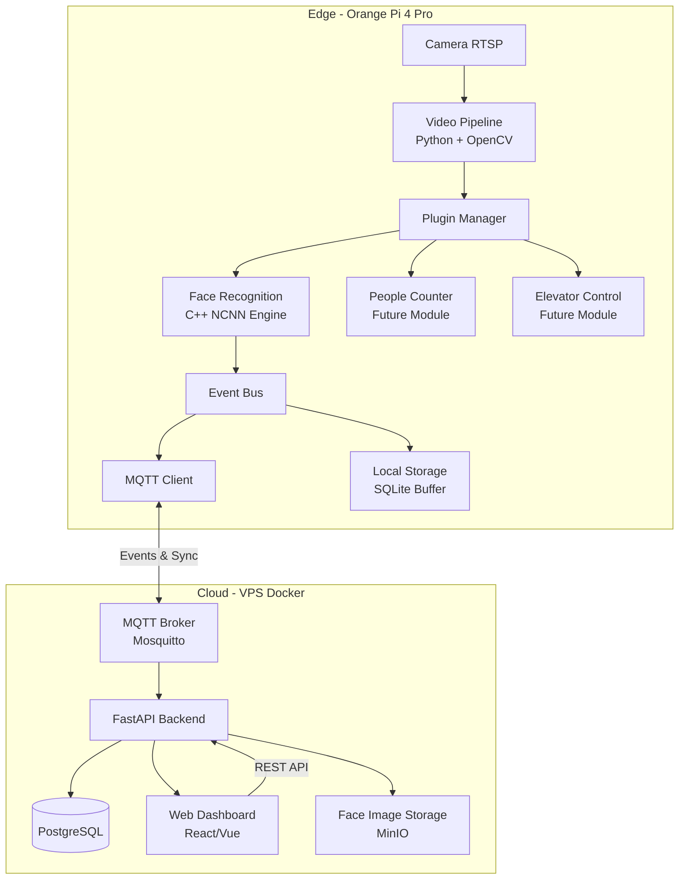
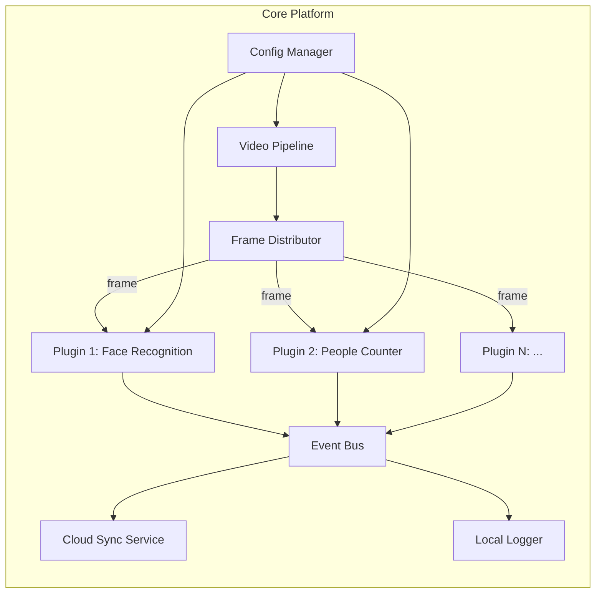

# Implementation Plan - Smart Cabin Platform

## Problem Statement

Xây dựng một nền tảng Smart Cabin có kiến trúc plugin-based cho thang máy, chạy trên Orange Pi 4 Pro (RK3399) với camera RTSP. Module đầu tiên là Face Recognition (nhận diện cư dân + ghi log), với khả năng mở rộng sang đếm người và điều khiển thang máy trong tương lai.

## Requirements

- **Edge device**: Orange Pi 4 Pro (RK3399, 6-core ARM, Mali-T860 GPU, 4GB RAM, Ubuntu/Debian)
- **Camera**: RTSP stream có sẵn
- **Architecture**: Edge + Cloud (self-hosted VPS)
- **Stack**: Python orchestration + C++ inference engine
- **Cloud**: Docker, FastAPI, PostgreSQL
- **Demo module**: Face Recognition - nhận diện < 50 cư dân, ghi log
- **Giao diện**: Web dashboard quản trị
- **Extensible**: Plugin architecture cho modules tương lai

## Background (Research Findings)

**Quan trọng - Hardware constraint**: Orange Pi 4 Pro dùng RK3399 (không phải RK3399**Pro**), chip này **KHÔNG có NPU chuyên dụng**. Do đó:

- Không thể dùng RKNN Toolkit để accelerate inference
- Inference phải chạy trên CPU (ARM NEON) hoặc Mali GPU (OpenCL)
- Cần chọn model lightweight, tối ưu cho ARM

**Model đề xuất**:

| Thành phần | Model | Lý do |
|-----------|-------|-------|
| Face Detection | **SCRFD-500M** hoặc **YuNet** | Siêu nhẹ (~0.5M params), <10ms trên ARM |
| Face Embedding | **MobileFaceNet** (từ InsightFace) | 1M params, 99.4% accuracy trên LFW, optimized cho mobile |
| Inference Framework | **NCNN** (Tencent) | C++ native, tối ưu ARM NEON, không dependency nặng |

**Communication đề xuất**: MQTT cho realtime events (face detected) + REST API cho admin operations (đăng ký face, query logs)

## Proposed Solution

### Kiến trúc tổng thể



### Kiến trúc Edge (Plugin-based)



### Project Structure

```
smart-cabin/
├── edge/                          # Edge application (Orange Pi)
│   ├── core/                      # Core platform
│   │   ├── video_pipeline.py      # RTSP capture & frame distribution
│   │   ├── plugin_manager.py      # Plugin lifecycle management
│   │   ├── event_bus.py           # Internal event system
│   │   ├── config.py              # Configuration management
│   │   └── cloud_sync.py         # MQTT + offline buffer
│   ├── plugins/                   # Plugin modules
│   │   └── face_recognition/
│   │       ├── plugin.py          # Plugin entry point
│   │       ├── detector.py        # Face detection wrapper
│   │       ├── recognizer.py      # Face embedding + matching
│   │       └── models/            # NCNN model files
│   ├── inference/                 # C++ inference engine
│   │   ├── CMakeLists.txt
│   │   ├── src/
│   │   │   ├── face_detector.cpp
│   │   │   ├── face_recognizer.cpp
│   │   │   └── python_bindings.cpp  # pybind11
│   │   └── include/
│   ├── tests/
│   ├── config.yaml
│   ├── requirements.txt
│   └── Dockerfile                 # For development/testing
├── cloud/                         # Cloud backend
│   ├── api/                       # FastAPI application
│   │   ├── main.py
│   │   ├── routers/
│   │   ├── models/
│   │   ├── services/
│   │   └── schemas/
│   ├── dashboard/                 # Web frontend
│   │   ├── src/
│   │   └── package.json
│   ├── docker-compose.yml         # PostgreSQL + Mosquitto + API + MinIO
│   ├── migrations/
│   └── tests/
├── shared/                        # Shared protocols/schemas
│   ├── mqtt_topics.py
│   └── event_schemas.py
└── docs/
```

## Task Breakdown

### Task 1: Khởi tạo project structure & Core Configuration System

**Objective**: Tạo skeleton project với config management system hoạt động.

**Implementation guidance**:
- Khởi tạo Git repo, tạo folder structure như trên
- Implement `edge/core/config.py` - load YAML config, support environment variables override
- Tạo `config.yaml` mẫu với các section: camera, plugins, mqtt, logging
- Setup Python virtual environment, `requirements.txt` cơ bản
- Viết unit tests cho config loading, validation, default values

**Test requirements**:
- Test load config từ YAML file
- Test override bằng environment variable
- Test validation (missing required fields, invalid values)
- Test default values khi field không có trong config

**Demo**: Chạy `python -m edge.core.config` in ra loaded configuration từ YAML file, verify environment override hoạt động.

---

### Task 2: Video Pipeline - RTSP Capture & Frame Distribution

**Objective**: Xây dựng video pipeline nhận stream RTSP và phân phối frames cho consumers.

**Implementation guidance**:
- Implement `edge/core/video_pipeline.py` sử dụng OpenCV VideoCapture với RTSP URL
- Design thread-safe frame buffer (ring buffer) để plugins consume frames không block pipeline
- Support configurable FPS (capture ở native FPS, distribute ở target FPS để tiết kiệm CPU)
- Implement graceful reconnection khi RTSP stream bị ngắt
- Callback-based frame distribution pattern (observer pattern)

**Test requirements**:
- Test kết nối RTSP stream (dùng mock hoặc local test stream)
- Test frame rate throttling (capture 25fps → distribute 5fps)
- Test reconnection logic khi stream ngắt
- Test memory không leak khi chạy lâu (frame buffer bounded)

**Demo**: Chạy video pipeline, log FPS đang nhận được, hiển thị frame count. Simulate ngắt kết nối và verify auto-reconnect.

---

### Task 3: Event Bus - Internal Communication System

**Objective**: Xây dựng event bus cho inter-plugin communication và logging.

**Implementation guidance**:
- Implement `edge/core/event_bus.py` - async event bus với pub/sub pattern
- Support event types: `face.detected`, `face.recognized`, `person.counted`, `system.error`...
- Thread-safe, non-blocking publish
- Support event handlers (sync và async)
- Event schema validation (dùng Pydantic models trong `shared/event_schemas.py`)

**Test requirements**:
- Test publish/subscribe pattern
- Test multiple subscribers cho cùng event type
- Test event schema validation (reject invalid events)
- Test thread safety (publish từ multiple threads)

**Demo**: Publish mock events, verify subscribers nhận được events, in ra event log.

---

### Task 4: Plugin Manager - Plugin Lifecycle & Registration

**Objective**: Xây dựng plugin manager quản lý lifecycle của các analysis modules.

**Implementation guidance**:
- Implement `edge/core/plugin_manager.py`
- Define `BasePlugin` abstract class với interface: `initialize()`, `process_frame()`, `shutdown()`
- Plugin discovery: load plugins từ `plugins/` directory dựa trên config
- Plugin lifecycle: init → running → paused → stopped
- Mỗi plugin chạy trong thread riêng, nhận frames từ video pipeline
- Health check: detect plugin crash, auto-restart

**Test requirements**:
- Test plugin discovery và loading
- Test plugin lifecycle transitions
- Test plugin isolation (1 plugin crash không ảnh hưởng plugin khác)
- Test frame routing đến enabled plugins

**Demo**: Tạo dummy plugin (chỉ log frame count), load nó qua config, verify nhận frames từ video pipeline và publish events.

---

### Task 5: C++ Inference Engine - Face Detection with NCNN

**Objective**: Build C++ face detection engine dùng NCNN, expose qua Python bindings.

**Implementation guidance**:
- Setup CMake project trong `edge/inference/`
- Integrate NCNN library (build from source cho ARM64 hoặc dùng prebuilt)
- Implement `face_detector.cpp`: load SCRFD/YuNet model, detect faces trong frame
- Output: list of bounding boxes + confidence scores + 5-point landmarks
- Implement `python_bindings.cpp` dùng pybind11 để expose C++ class cho Python
- Optimize: ARM NEON enabled, multi-thread inference

**Test requirements**:
- Test model loading (valid model, invalid path)
- Test detection trên sample images (known faces)
- Test detection accuracy trên edge cases (multiple faces, side view, low light)
- Test performance: measure inference time per frame trên target hardware
- Test Python bindings hoạt động correctly

**Demo**: Chạy face detection trên sample image từ Python, in ra bounding boxes và confidence. Report inference time (target: <50ms per frame trên RK3399).

---

### Task 6: C++ Inference Engine - Face Embedding (MobileFaceNet)

**Objective**: Thêm face embedding extraction vào C++ engine.

**Implementation guidance**:
- Implement `face_recognizer.cpp`: load MobileFaceNet NCNN model
- Input: aligned face image (112x112), output: 128-dim embedding vector
- Face alignment: dùng 5-point landmarks từ detector để affine transform
- Normalize embedding vector (L2 norm)
- Expose qua pybind11: `extract_embedding(aligned_face) -> numpy array`

**Test requirements**:
- Test embedding extraction trên known faces
- Test embedding consistency (cùng người, khác ảnh → cosine similarity > 0.6)
- Test embedding discrimination (khác người → cosine similarity < 0.4)
- Test performance: measure inference time

**Demo**: Extract embeddings từ 2 ảnh cùng người và 2 ảnh khác người, tính cosine similarity, verify discrimination. Report inference time.

---

### Task 7: Face Recognition Plugin - Integration & Matching

**Objective**: Tạo Face Recognition plugin hoàn chỉnh, kết nối detection + embedding + matching.

**Implementation guidance**:
- Implement `edge/plugins/face_recognition/plugin.py` kế thừa BasePlugin
- Pipeline: frame → detect faces → align → extract embedding → match against database
- Face database: local SQLite lưu embeddings + person_id + metadata
- Matching: cosine similarity với threshold configurable (default 0.6)
- Anti-spoofing cơ bản: reject faces quá nhỏ (< 80px), blur detection
- Rate limiting: không recognize cùng 1 người liên tục (cooldown 30s)
- Publish events: `face.recognized` (known) hoặc `face.unknown` (unknown)

**Test requirements**:
- Test full pipeline: frame → detection → embedding → matching
- Test với registered faces (should recognize)
- Test với unknown faces (should publish unknown event)
- Test cooldown logic
- Test face database CRUD operations

**Demo**: Đăng ký 2-3 khuôn mặt vào database, chạy plugin với video stream, verify nhận diện đúng và publish events qua event bus.

---

### Task 8: Cloud Backend - Database & API Foundation

**Objective**: Setup cloud backend với Docker, PostgreSQL, và core API endpoints.

**Implementation guidance**:
- Tạo `docker-compose.yml`: PostgreSQL, Mosquitto MQTT broker, FastAPI app, MinIO (face images)
- Design database schema: `persons`, `face_embeddings`, `recognition_logs`, `devices`
- Implement FastAPI app với basic structure (routers, models, schemas)
- Implement CRUD APIs: Person management (create, read, update, delete)
- Implement face enrollment API: upload ảnh → extract embedding (server-side) → store
- Alembic migrations setup

**Test requirements**:
- Test database migrations run successfully
- Test CRUD APIs cho person management
- Test face enrollment flow
- Test API validation (invalid inputs)
- Integration test với Docker compose

**Demo**: Docker compose up, tạo person qua API, upload face image, verify data trong PostgreSQL.

---

### Task 9: Cloud Backend - MQTT Integration & Recognition Logs

**Objective**: Kết nối MQTT broker với backend để nhận events từ edge và lưu logs.

**Implementation guidance**:
- Implement MQTT subscriber trong FastAPI app (listen to `cabin/+/face/recognized`)
- Khi nhận event → lưu vào `recognition_logs` table (person_id, timestamp, confidence, device_id)
- Implement REST API để query logs (filter by person, date range, device)
- Implement sync protocol: edge gửi new recognitions, cloud confirm receipt
- Offline buffer: edge lưu events khi mất kết nối, sync khi reconnect
- MQTT topic design: `cabin/{device_id}/face/recognized`, `cabin/{device_id}/status`

**Test requirements**:
- Test MQTT message handling (valid/invalid messages)
- Test log persistence
- Test log query API với filters
- Test offline → online sync scenario

**Demo**: Publish mock recognition event qua MQTT, verify log xuất hiện trong database, query qua API.

---

### Task 10: Edge Cloud Sync Service

**Objective**: Implement edge-side cloud sync với MQTT và offline buffering.

**Implementation guidance**:
- Implement `edge/core/cloud_sync.py`
- MQTT client (paho-mqtt) kết nối Mosquitto broker
- Subscribe to commands từ cloud: `cabin/{device_id}/command/+` (sync faces, update config...)
- Publish events: recognition events, health status, heartbeat
- Offline buffer: SQLite queue, flush khi reconnected
- Face database sync: cloud push new/updated face embeddings xuống edge

**Test requirements**:
- Test MQTT connection và reconnection
- Test event publishing
- Test offline buffering (disconnect → buffer → reconnect → flush)
- Test face database sync (cloud → edge)

**Demo**: Chạy edge app, disconnect MQTT, generate recognition events (buffered), reconnect → verify events sync lên cloud.

---

### Task 11: Web Dashboard - Person Management & Face Enrollment

**Objective**: Xây dựng web dashboard để quản lý cư dân và đăng ký khuôn mặt.

**Implementation guidance**:
- Setup React (hoặc Vue 3) project trong `cloud/dashboard/`
- Pages: Login, Dashboard (overview), Person List, Person Detail, Face Enrollment
- Person management: CRUD operations qua REST API
- Face enrollment: webcam capture hoặc upload ảnh, preview detected face, confirm enrollment
- Responsive design (sử dụng trên tablet/phone khi đăng ký face)
- Component library: Ant Design hoặc shadcn/ui

**Test requirements**:
- Test person CRUD flow (create, edit, delete)
- Test face enrollment flow (upload → preview → confirm)
- Test form validation
- Test responsive layout

**Demo**: Mở dashboard, tạo person mới, upload face photo, verify enrollment thành công.

---

### Task 12: Web Dashboard - Live Monitoring & Recognition Logs

**Objective**: Thêm trang monitoring realtime và xem recognition history.

**Implementation guidance**:
- Real-time dashboard: WebSocket từ backend push live recognition events
- Recognition log page: table với filter (person, date range), pagination
- Activity timeline: visual timeline ai đi thang lúc nào
- Device status: hiển thị edge device online/offline, last heartbeat
- Statistics: số lần nhận diện/ngày, peak hours chart

**Test requirements**:
- Test WebSocket connection và live updates
- Test log filtering và pagination
- Test statistics calculation accuracy

**Demo**: Chạy full system (edge + cloud + dashboard), nhận diện face → event xuất hiện realtime trên dashboard, xem log history.

---

### Task 13: End-to-End Integration & System Testing

**Objective**: Kết nối tất cả components, test end-to-end flow, optimize performance.

**Implementation guidance**:
- Integration test: Camera → Edge → Face Recognition → MQTT → Cloud → Dashboard
- Performance profiling trên Orange Pi 4 Pro: CPU usage, memory, latency
- Optimize nếu cần: reduce frame processing rate, model quantization (INT8)
- Error handling hardening: network failures, camera disconnects, disk full
- Logging consolidation: structured logging cho debugging
- Documentation: setup guide, API docs, deployment guide

**Test requirements**:
- End-to-end test: đăng ký face → nhận diện → log xuất hiện trên dashboard
- Stress test: chạy continuous 24h, verify no memory leak
- Performance test: latency từ face appear → event on dashboard < 3s
- Failure recovery test: simulate các failure scenarios

**Demo**: Demo full flow: Đăng ký cư dân trên dashboard → cư dân đi qua camera → nhận diện thành công → log realtime trên dashboard. System chạy ổn định liên tục.

---

## Technology Summary

| Component | Technology | Lý do |
|-----------|-----------|-------|
| Edge OS | Ubuntu/Debian (ARM64) | Official support |
| Edge Orchestration | Python 3.10+ | Fast development, good ML ecosystem |
| Inference Engine | C++ + NCNN + pybind11 | Max performance trên ARM without NPU |
| Face Detection | SCRFD-500M / YuNet | Ultra-lightweight, <10ms |
| Face Embedding | MobileFaceNet | 1M params, high accuracy |
| Edge Database | SQLite | Lightweight, no server needed |
| Communication | MQTT (Mosquitto) | Lightweight IoT protocol, pub/sub |
| Cloud API | FastAPI (Python) | Async, fast, auto-docs |
| Cloud Database | PostgreSQL | Robust, scalable |
| Object Storage | MinIO | S3-compatible, self-hosted |
| Web Dashboard | React + Ant Design | Rich components, responsive |
| Containerization | Docker Compose | Easy deployment |
