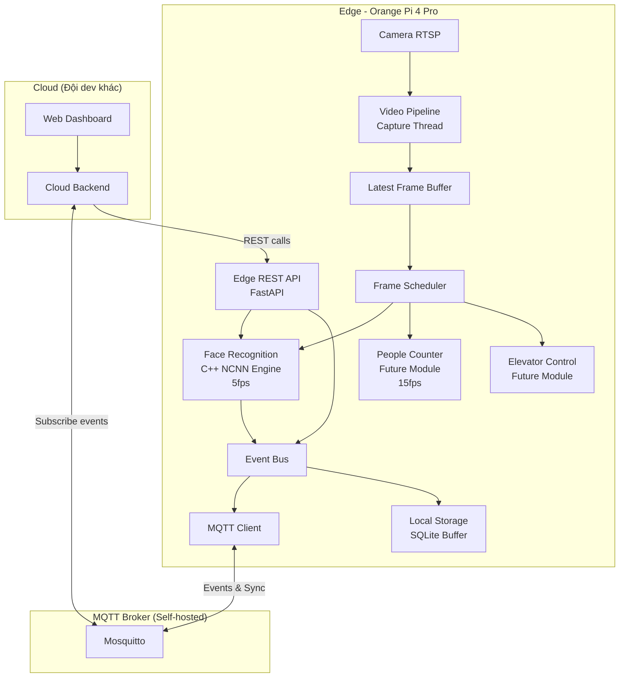
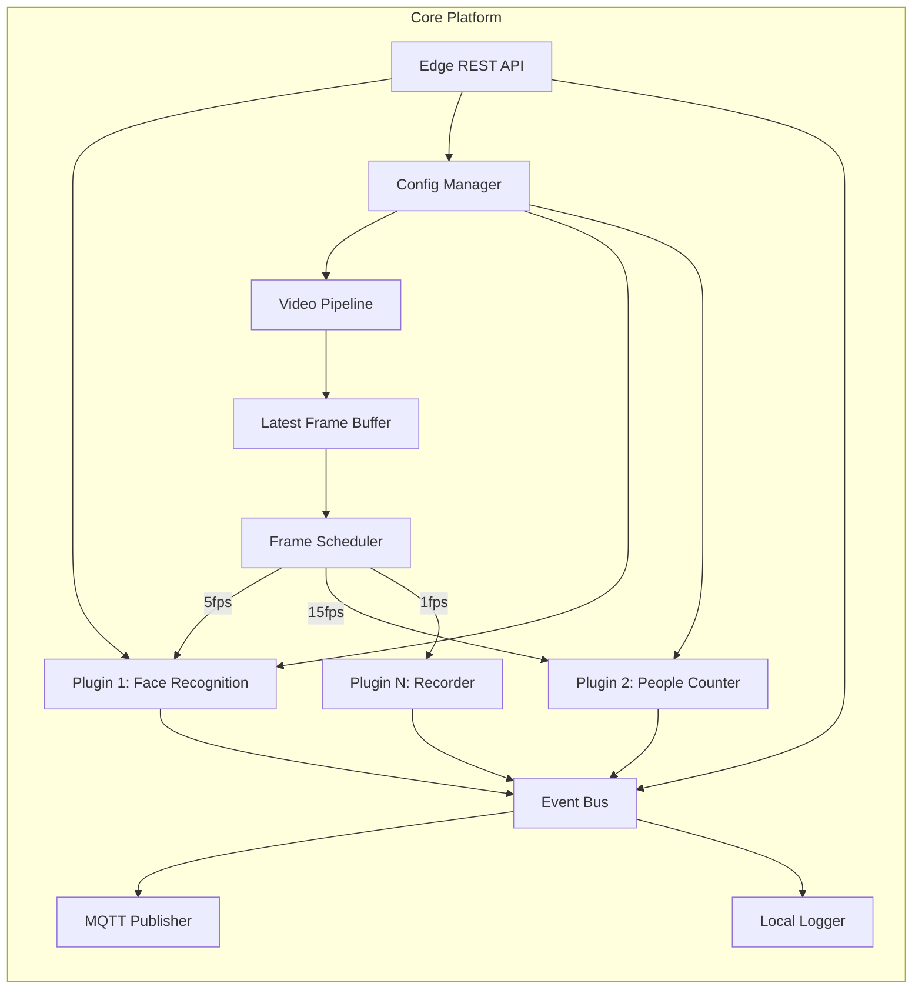

# Implementation Plan - Smart Cabin Platform

## Problem Statement

Xây dựng một nền tảng Smart Cabin có kiến trúc plugin-based cho thang máy, chạy trên Orange Pi 4 Pro (RK3399) với camera RTSP. Module đầu tiên là Face Recognition (nhận diện cư dân + ghi log), với khả năng mở rộng sang đếm người và điều khiển thang máy trong tương lai.

## Requirements

- **Edge device**: Orange Pi 4 Pro (RK3399, 6-core ARM, Mali-T860 GPU, 4GB RAM, Ubuntu/Debian)
- **Camera**: RTSP stream có sẵn
- **Architecture**: Edge + Cloud (self-hosted)
- **Stack**: Python orchestration + C++ inference engine
- **Edge API**: REST API (FastAPI) cho admin operations + MQTT cho realtime events
- **Cloud**: Do đội dev khác phát triển — chỉ cần cung cấp API spec/protocol
- **MQTT Broker**: Tự host (trên edge hoặc VPS riêng)
- **Demo module**: Face Recognition - nhận diện < 50 cư dân, ghi log
- **Face Enrollment**: Trực tiếp trên Edge (CLI/script)
- **Extensible**: Plugin architecture cho modules tương lai

## Background (Research Findings)

**Quan trọng - Hardware constraint**: Orange Pi 4 Pro dùng RK3399 (không phải RK3399**Pro**), chip này **KHÔNG có NPU chuyên dụng**. Do đó:

- Không thể dùng RKNN Toolkit để accelerate inference
- Inference phải chạy trên CPU (ARM NEON) hoặc Mali GPU (OpenCL)
- Cần chọn model lightweight, tối ưu cho ARM

**Model đề xuất**:

| Thành phần | Model | Lý do |
|-----------|-------|-------|
| Face Detection | **SCRFD-500M** hoặc **YuNet** | Siêu nhẹ (~0.5M params), <10ms trên ARM |
| Face Embedding | **MobileFaceNet** (từ InsightFace) | 1M params, 99.4% accuracy trên LFW, optimized cho mobile |
| Inference Framework | **NCNN** (Tencent) | C++ native, tối ưu ARM NEON, không dependency nặng |

**Communication đề xuất**: MQTT cho realtime events (face detected) + REST API cho admin operations (query status, manage faces)

## Proposed Solution

### Kiến trúc tổng thể



### Kiến trúc Edge (Plugin-based)



### Edge API Design

**REST API** (chạy trên Edge, cho cloud/admin gọi vào):

| Method | Endpoint | Mô tả |
|--------|----------|--------|
| GET | `/api/status` | System status, uptime, plugin states |
| GET | `/api/faces` | Danh sách faces đã đăng ký |
| GET | `/api/faces/{id}` | Chi tiết 1 face |
| POST | `/api/faces/enroll` | Đăng ký face mới (upload ảnh) |
| DELETE | `/api/faces/{id}` | Xóa face |
| GET | `/api/logs` | Recognition logs (filter by time, person) |
| GET | `/api/plugins` | Plugin status list |
| POST | `/api/plugins/{name}/restart` | Restart plugin |
| GET | `/api/stats` | Pipeline stats (FPS, frames, etc.) |

**MQTT Topics** (Edge publish → Cloud subscribe):

| Topic | Direction | Payload |
|-------|-----------|---------|
| `cabin/{device_id}/face/recognized` | Edge → Cloud | `{person_id, person_name, confidence, timestamp, bbox}` |
| `cabin/{device_id}/face/unknown` | Edge → Cloud | `{confidence, timestamp, bbox}` |
| `cabin/{device_id}/status/heartbeat` | Edge → Cloud | `{uptime, cpu, memory, fps}` |
| `cabin/{device_id}/system/error` | Edge → Cloud | `{error_message, error_type, recoverable}` |
| `cabin/{device_id}/system/start` | Edge → Cloud | `{timestamp, version}` |
| `cabin/{device_id}/system/stop` | Edge → Cloud | `{timestamp, reason}` |
| `cabin/{device_id}/command/+` | Cloud → Edge | Commands (sync, restart, etc.) |

### Project Structure

```
smart-cabin/
├── edge/                          # Edge application (Orange Pi)
│   ├── core/                      # Core platform
│   │   ├── video_pipeline.py      # RTSP capture & frame distribution
│   │   ├── plugin_manager.py      # Plugin lifecycle management
│   │   ├── event_bus.py           # Internal event system
│   │   ├── config.py              # Configuration management
│   │   └── cloud_sync.py          # MQTT client + offline buffer
│   ├── api/                       # Edge REST API
│   │   ├── main.py                # FastAPI app
│   │   ├── routers/
│   │   │   ├── faces.py           # Face enrollment/management
│   │   │   ├── status.py          # System status
│   │   │   └── logs.py            # Recognition logs
│   │   └── schemas.py             # API request/response models
│   ├── plugins/                   # Plugin modules
│   │   └── face_recognition/
│   │       ├── plugin.py          # Plugin entry point
│   │       ├── detector.py        # Face detection wrapper
│   │       ├── recognizer.py      # Face embedding + matching
│   │       ├── database.py        # Local face database (SQLite)
│   │       └── models/            # NCNN model files
│   ├── inference/                 # C++ inference engine
│   │   ├── CMakeLists.txt
│   │   ├── src/
│   │   │   ├── face_detector.cpp
│   │   │   ├── face_recognizer.cpp
│   │   │   └── python_bindings.cpp  # pybind11
│   │   └── include/
│   ├── tools/                     # CLI tools
│   │   ├── enroll_face.py         # Face enrollment script
│   │   └── data_recorder.py      # Video/snapshot recorder for training data
│   ├── data/                      # Collected training data (gitignored)
│   │   ├── snapshots/            # Auto-captured face crops
│   │   ├── frames/               # Periodic full-frame captures
│   │   └── videos/               # Recorded video segments
│   ├── tests/
│   ├── config.yaml
│   └── requirements.txt
├── shared/                        # Shared protocols/schemas
│   ├── mqtt_topics.py
│   └── event_schemas.py
├── docs/
│   ├── implementation_plan.md
│   └── api_spec.md                # API documentation cho đội cloud
└── deploy/
    ├── setup_edge.sh              # Edge setup script
    ├── mosquitto.conf             # MQTT broker config
    └── smart-cabin.service        # Systemd service
```

## Task Breakdown

### Task 1: Khởi tạo project structure & Core Configuration System ✅

**Objective**: Tạo skeleton project với config management system hoạt động.

**Implementation guidance**:
- Khởi tạo Git repo, tạo folder structure
- Implement `edge/core/config.py` - load YAML config, support environment variables override
- Tạo `config.yaml` mẫu với các section: camera, plugins, mqtt, logging
- Setup Python virtual environment (uv), `requirements.txt`
- Viết unit tests cho config loading, validation, default values

**Test requirements**:
- Test load config từ YAML file
- Test override bằng environment variable
- Test validation (missing required fields, invalid values)
- Test default values khi field không có trong config

**Demo**: Chạy `python -m edge.core.config` in ra loaded configuration từ YAML file, verify environment override hoạt động.

---

### Task 2: Video Pipeline - RTSP Capture & Frame Distribution ✅

**Objective**: Xây dựng video pipeline nhận stream RTSP và phân phối frames cho consumers.

**Implementation guidance**:
- Implement `edge/core/video_pipeline.py` sử dụng OpenCV VideoCapture với RTSP URL
- Latest frame buffer (1 frame, atomic swap) — không dùng ring buffer, tiết kiệm RAM
- Frame Scheduler: per-callback FPS control (mỗi plugin register với target FPS riêng)
- Implement graceful reconnection khi RTSP stream bị ngắt
- Connection timeout cho RTSP
- Callback-based frame distribution pattern (observer pattern)

**Test requirements**:
- Test kết nối RTSP stream (dùng mock hoặc local test stream)
- Test per-callback FPS scheduling (callback A ở 5fps, callback B ở 20fps)
- Test reconnection logic khi stream ngắt
- Test memory không leak khi chạy lâu (latest frame buffer bounded)

**Demo**: Chạy video pipeline với camera thực, hiển thị FPS/Resolution/Timestamp/Latency/Reconnects trên overlay.

---

### Task 3: Event Bus - Internal Communication System

**Objective**: Xây dựng event bus cho inter-plugin communication và logging.

**Implementation guidance**:
- Implement `edge/core/event_bus.py` - async event bus với pub/sub pattern
- Support event types: `face.detected`, `face.recognized`, `person.counted`, `system.error`...
- Thread-safe, non-blocking publish
- Support event handlers (sync và async)
- Event schema validation (dùng Pydantic models trong `shared/event_schemas.py`)

**Test requirements**:
- Test publish/subscribe pattern
- Test multiple subscribers cho cùng event type
- Test event schema validation (reject invalid events)
- Test thread safety (publish từ multiple threads)

**Demo**: Publish mock events, verify subscribers nhận được events, in ra event log.

---

### Task 4: Plugin Manager - Plugin Lifecycle & Registration

**Objective**: Xây dựng plugin manager quản lý lifecycle của các analysis modules.

**Implementation guidance**:
- Implement `edge/core/plugin_manager.py`
- Define `BasePlugin` abstract class với interface: `initialize()`, `process_frame()`, `shutdown()`
- Plugin discovery: load plugins từ `plugins/` directory dựa trên config
- Plugin lifecycle: init → running → paused → stopped
- Mỗi plugin chạy trong thread riêng, nhận frames từ video pipeline
- Health check: detect plugin crash, auto-restart

**Test requirements**:
- Test plugin discovery và loading
- Test plugin lifecycle transitions
- Test plugin isolation (1 plugin crash không ảnh hưởng plugin khác)
- Test frame routing đến enabled plugins

**Demo**: Tạo dummy plugin (chỉ log frame count), load nó qua config, verify nhận frames từ video pipeline và publish events.

---

### Task 5: C++ Inference Engine - Face Detection with NCNN

**Objective**: Build C++ face detection engine dùng NCNN, expose qua Python bindings.

**Implementation guidance**:
- Setup CMake project trong `edge/inference/`
- Integrate NCNN library (build from source cho ARM64 hoặc dùng prebuilt)
- Implement `face_detector.cpp`: load SCRFD/YuNet model, detect faces trong frame
- Output: list of bounding boxes + confidence scores + 5-point landmarks
- Implement `python_bindings.cpp` dùng pybind11 để expose C++ class cho Python
- Optimize: ARM NEON enabled, multi-thread inference

**Test requirements**:
- Test model loading (valid model, invalid path)
- Test detection trên sample images (known faces)
- Test detection accuracy trên edge cases (multiple faces, side view, low light)
- Test performance: measure inference time per frame trên target hardware
- Test Python bindings hoạt động correctly

**Demo**: Chạy face detection trên sample image từ Python, in ra bounding boxes và confidence. Report inference time (target: <50ms per frame trên RK3399).

---

### Task 6: C++ Inference Engine - Face Embedding (MobileFaceNet)

**Objective**: Thêm face embedding extraction vào C++ engine.

**Implementation guidance**:
- Implement `face_recognizer.cpp`: load MobileFaceNet NCNN model
- Input: aligned face image (112x112), output: 128-dim embedding vector
- Face alignment: dùng 5-point landmarks từ detector để affine transform
- Normalize embedding vector (L2 norm)
- Expose qua pybind11: `extract_embedding(aligned_face) -> numpy array`

**Test requirements**:
- Test embedding extraction trên known faces
- Test embedding consistency (cùng người, khác ảnh → cosine similarity > 0.6)
- Test embedding discrimination (khác người → cosine similarity < 0.4)
- Test performance: measure inference time

**Demo**: Extract embeddings từ 2 ảnh cùng người và 2 ảnh khác người, tính cosine similarity, verify discrimination. Report inference time.

---

### Task 7: Face Recognition Plugin - Integration & Matching

**Objective**: Tạo Face Recognition plugin hoàn chỉnh, kết nối detection + embedding + matching.

**Implementation guidance**:
- Implement `edge/plugins/face_recognition/plugin.py` kế thừa BasePlugin
- Implement `edge/plugins/face_recognition/database.py` - local SQLite face database
- Pipeline: frame → detect faces → align → extract embedding → match against database
- Matching: cosine similarity với threshold configurable (default 0.6)
- Anti-spoofing cơ bản: reject faces quá nhỏ (< 80px), blur detection
- Rate limiting: không recognize cùng 1 người liên tục (cooldown 30s)
- Publish events: `face.recognized` (known) hoặc `face.unknown` (unknown)

**Test requirements**:
- Test full pipeline: frame → detection → embedding → matching
- Test với registered faces (should recognize)
- Test với unknown faces (should publish unknown event)
- Test cooldown logic
- Test face database CRUD operations

**Demo**: Đăng ký 2-3 khuôn mặt vào database, chạy plugin với video stream, verify nhận diện đúng và publish events qua event bus.

---

### Task 8: Data Collection Tool & Auto-Snapshot

**Objective**: Thu thập dữ liệu training từ camera — cả manual recording lẫn auto-snapshot khi detect face.

**Implementation guidance**:

**Phần A - Manual Data Recorder** (`edge/tools/data_recorder.py`):
- CLI tool chạy độc lập (không cần plugin system)
- Modes:
  - **Record video**: Ghi video segments (configurable duration, e.g., 5 phút/file)
  - **Periodic snapshot**: Chụp full-frame mỗi N giây
  - **Continuous**: Kết hợp cả video + snapshot
- Output structure:
  ```
  data/
  ├── videos/YYYY-MM-DD/cabin-001_HH-MM-SS.mp4
  └── frames/YYYY-MM-DD/cabin-001_HH-MM-SS_frame.jpg
  ```
- Storage management: auto-delete files cũ khi disk usage > threshold
- Metadata: lưu JSON sidecar (timestamp, resolution, camera_id, duration)

**Phần B - Auto Face Snapshot** (tích hợp vào Face Recognition Plugin):
- Khi detect face → lưu:
  - Face crop (aligned, 112x112) → `data/snapshots/faces/`
  - Full frame with bbox annotation → `data/snapshots/full/`
- Label: `recognized_{person_id}_{timestamp}.jpg` hoặc `unknown_{timestamp}.jpg`
- Configurable: enable/disable, max snapshots per person per day (tránh spam)
- Hữu ích cho: fine-tune model, review false positives/negatives

**Test requirements**:
- Test video recording (duration, file rotation)
- Test snapshot capture (periodic interval)
- Test storage cleanup (disk threshold)
- Test auto face snapshot (trigger on detect event)
- Test output file naming/structure

**Demo**:
- Chạy `data_recorder.py --mode video --duration 60` → verify video file 1 phút được tạo
- Chạy `data_recorder.py --mode snapshot --interval 5` → verify snapshot mỗi 5s
- Chạy full system → verify face crops tự động xuất hiện trong `data/snapshots/`

---

### Task 9: Face Enrollment Tool (CLI)

**Objective**: Tạo tool đăng ký khuôn mặt trực tiếp trên Edge device.

**Implementation guidance**:
- Implement `edge/tools/enroll_face.py` - CLI tool
- Modes:
  - **Camera capture**: Mở camera, hiển thị preview, nhấn key để capture face
  - **Image file**: Truyền path ảnh có sẵn
- Flow: Capture/load ảnh → Detect face → Extract embedding → Lưu vào SQLite
- Metadata: person_id, name, department/floor (optional)
- Validation: đảm bảo chỉ 1 face trong ảnh, đủ chất lượng
- Support multiple ảnh cho cùng 1 người (tăng accuracy)

**Test requirements**:
- Test enrollment flow (mock camera + mock inference)
- Test validation (no face, multiple faces, blurry)
- Test database persistence
- Test duplicate detection

**Demo**: Chạy CLI tool, capture face từ camera, đăng ký thành công, verify trong database. Sau đó face recognition nhận diện được người vừa đăng ký.

---

### Task 10: MQTT Client & Cloud Sync

**Objective**: Implement MQTT client trên edge để publish events và nhận commands từ cloud.

**Implementation guidance**:
- Implement `edge/core/cloud_sync.py`
- MQTT client (paho-mqtt) kết nối Mosquitto broker
- Publish events khi Event Bus emit: recognition events, heartbeat, system status
- Subscribe commands từ cloud: `cabin/{device_id}/command/+`
- Offline buffer: SQLite queue, flush khi reconnected
- Heartbeat: publish system stats mỗi 30s (CPU, memory, FPS, uptime)
- Setup Mosquitto broker config (deploy/mosquitto.conf)

**Test requirements**:
- Test MQTT connection và reconnection
- Test event publishing (face recognized → MQTT message)
- Test offline buffering (disconnect → buffer → reconnect → flush)
- Test command handling (cloud → edge)
- Test heartbeat publishing

**Demo**: Chạy edge + mosquitto, subscribe topic bằng `mosquitto_sub`, verify events xuất hiện khi face recognized. Test offline buffering.

---

### Task 11: Edge REST API

**Objective**: Expose REST API trên Edge cho đội cloud và admin operations.

**Implementation guidance**:
- Implement `edge/api/main.py` - FastAPI app chạy trên port 8080
- Endpoints:
  - `GET /api/status` - system status
  - `GET /api/faces` - list registered faces
  - `POST /api/faces/enroll` - đăng ký face (upload ảnh)
  - `DELETE /api/faces/{id}` - xóa face
  - `GET /api/logs` - recognition logs với filter
  - `GET /api/plugins` - plugin status
  - `POST /api/plugins/{name}/restart` - restart plugin
  - `GET /api/stats` - pipeline stats
- Auto-generated OpenAPI docs (`/docs`) cho đội cloud tham khảo
- CORS enabled cho dashboard gọi trực tiếp

**Test requirements**:
- Test tất cả endpoints (happy path + error cases)
- Test face enrollment qua API (upload image)
- Test query logs với filters (date range, person_id)
- Test plugin restart endpoint

**Demo**: Start API server, dùng Swagger UI (`/docs`) để test các endpoints. Cung cấp API spec cho đội cloud.

---

### Task 12: API Documentation & Protocol Spec

**Objective**: Viết tài liệu API/Protocol cho đội cloud integrate.

**Implementation guidance**:
- Tạo `docs/api_spec.md`:
  - REST API specification (endpoints, request/response schemas, auth)
  - MQTT topics & message formats (JSON schemas)
  - Error codes & handling
  - Example requests/responses
- Auto-export OpenAPI JSON từ FastAPI (`openapi.json`)
- Sequence diagrams cho main flows:
  - Face enrollment flow
  - Face recognition → event → cloud
  - Heartbeat & health monitoring
  - Offline sync protocol

**Test requirements**: N/A (documentation task)

**Demo**: Deliver `docs/api_spec.md` + `openapi.json` cho đội cloud.

---

### Task 13: End-to-End Integration & System Testing

**Objective**: Kết nối tất cả components, test end-to-end flow, optimize performance.

**Implementation guidance**:
- Integration test: Camera → Edge → Face Recognition → MQTT → broker
- Integration test: Cloud team gọi Edge REST API
- Performance profiling trên Orange Pi 4 Pro: CPU usage, memory, latency
- Optimize nếu cần: reduce frame processing rate, model quantization (INT8)
- Error handling hardening: network failures, camera disconnects, disk full
- Logging consolidation: structured logging cho debugging
- Systemd service setup (deploy/smart-cabin.service)
- Deployment documentation

**Test requirements**:
- End-to-end test: đăng ký face → nhận diện → event qua MQTT
- Stress test: chạy continuous 24h, verify no memory leak
- Performance test: latency từ face appear → MQTT event < 1s
- Failure recovery test: simulate các failure scenarios
- API load test: concurrent requests

**Demo**: Demo full flow trên Orange Pi: Đăng ký cư dân → cư dân đi qua camera → nhận diện → event publish qua MQTT + log qua REST API. System chạy ổn định, đội cloud subscribe thành công.

---

## Technology Summary

| Component | Technology | Lý do |
|-----------|-----------|-------|
| Edge OS | Ubuntu/Debian (ARM64) | Official support |
| Edge Orchestration | Python 3.12+ | Fast development, good ML ecosystem |
| Inference Engine | C++ + NCNN + pybind11 | Max performance trên ARM without NPU |
| Face Detection | SCRFD-500M / YuNet | Ultra-lightweight, <10ms |
| Face Embedding | MobileFaceNet | 1M params, high accuracy |
| Edge Database | SQLite | Lightweight, no server needed |
| Edge REST API | FastAPI | Async, auto-docs (OpenAPI), lightweight |
| Communication | MQTT (Mosquitto) | Lightweight IoT protocol, pub/sub |
| MQTT Broker | Mosquitto (self-hosted) | Simple, reliable, low resource |
| Containerization | Systemd service | Native Linux, no Docker overhead on ARM |

## Phân chia trách nhiệm

| Phần | Ai làm | Giao tiếp |
|------|--------|-----------|
| Edge Platform (tất cả tasks trên) | Bạn | — |
| MQTT Broker setup | Bạn | Cung cấp broker address cho cloud team |
| Cloud Backend | Đội cloud dev | Subscribe MQTT + gọi Edge REST API |
| Web Dashboard | Đội cloud dev | Dùng Cloud Backend API |
| API Spec & Protocol docs | Bạn cung cấp | `docs/api_spec.md` + OpenAPI JSON |
